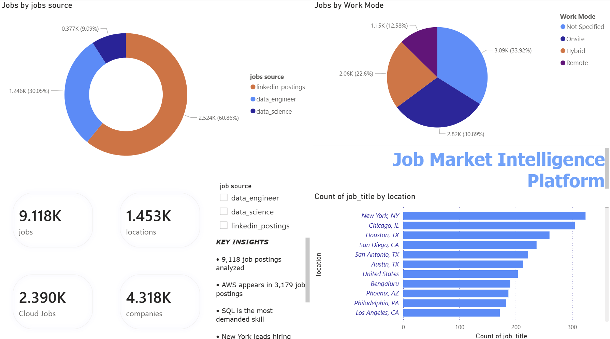
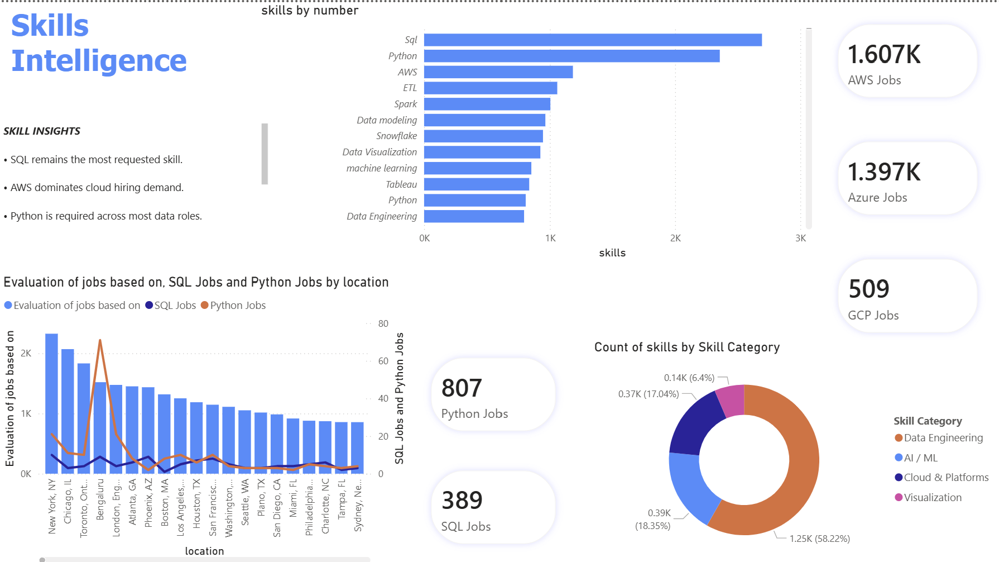

# Job Market Intelligence Platform

## Overview

The Job Market Intelligence Platform is an end-to-end cloud data engineering and analytics project built using Python, AWS, and Power BI. The platform integrates job market data from multiple sources, transforms and standardizes the data, and provides interactive dashboards for analyzing hiring trends, skill demand, cloud technology adoption, and geographic job opportunities.

This project demonstrates practical data engineering concepts including data ingestion, ETL pipelines, cloud storage, metadata cataloging, serverless analytics, and business intelligence reporting.

---

## Business Problem

The technology job market is highly dynamic, making it difficult for job seekers and organizations to understand:

* Which skills are most in demand
* Which cloud platforms dominate hiring requirements
* Which cities have the highest hiring activity
* What types of roles organizations are actively recruiting for

This platform consolidates job postings from multiple datasets into a unified analytics layer that provides actionable insights into current market trends.

---

## Dataset Summary

### Data Sources

1. Data Engineer Jobs Dataset
2. Data Science Jobs Dataset
3. LinkedIn Job Postings Dataset

### Combined Dataset Statistics

| Metric             | Value |
| ------------------ | ----: |
| Total Job Postings | 9,118 |
| Companies          | 4,329 |
| Locations          | 1,455 |

---

## Architecture

```text
Kaggle Datasets
        │
        ▼
 Python ETL Pipeline
        │
        ▼
 AWS S3 Data Lake
        │
        ▼
 AWS Glue Catalog
        │
        ▼
 Amazon Athena
        │
        ▼
 Power BI Dashboards
```

---

## Dashboard Preview






## Technology Stack

| Layer            | Technology     |
| ---------------- | -------------- |
| Data Ingestion   | Python, Pandas |
| Data Processing  | Python ETL     |
| Cloud Storage    | AWS S3         |
| Metadata Catalog | AWS Glue       |
| Query Engine     | Amazon Athena  |
| File Format      | CSV, Parquet   |
| Visualization    | Power BI       |
| Version Control  | Git, GitHub    |

---

## Project Workflow

### 1. Data Ingestion

Multiple Kaggle datasets were collected and standardized into a common schema using Python.

### 2. Data Transformation

The ETL pipeline performs:

* Column standardization
* Dataset consolidation
* Missing value handling
* Skill extraction
* Data quality checks

### 3. Data Lake Storage

Processed datasets are stored in AWS S3 using a data lake architecture:

```text
job-market-intelligence-platform/

├── raw/
├── processed/
└── curated/
```

### 4. Metadata Cataloging

AWS Glue Crawlers automatically discover schemas and create metadata tables for querying.

### 5. Analytics Layer

Amazon Athena enables serverless SQL analytics directly on S3 data.

### 6. Business Intelligence

Power BI dashboards provide visual insights into:

* Hiring trends
* Skill demand
* Cloud platform adoption
* Geographic hiring patterns

---

## Key Findings

### Top Hiring Locations

* New York, NY
* Chicago, IL
* Houston, TX
* San Diego, CA
* Austin, TX

### Most In-Demand Skills

* SQL
* Python
* AWS
* Machine Learning
* Azure

### Cloud Platform Demand

| Platform | Job Postings |
| -------- | -----------: |
| AWS      |        3,179 |
| Azure    |        2,141 |
| GCP      |          919 |

### Dataset Distribution

| Source             | Records |
| ------------------ | ------: |
| LinkedIn Postings  |   6,025 |
| Data Engineer Jobs |   2,528 |
| Data Science Jobs  |     565 |

---

## Dashboard Features

### Executive Overview

* Total Jobs
* Total Companies
* Total Locations
* AWS Job Demand
* Source Distribution
* Work Mode Analysis
* Top Hiring Cities

### Skills & Technology Intelligence

* Top Skills Analysis
* Cloud Platform Comparison
* Skill Category Breakdown
* Technology Demand Insights

---

## Repository Structure

```text
job-market-intelligence-platform/

├── data/
│   ├── raw/
│   └── processed/
│
├── scripts/
│   ├── create_job_master.py
│   └── data_profiling.py
│
├── powerbi/
│   └── JobMarketDashboard.pbix
│
├── screenshots/
│
├── README.md
│
└── requirements.txt
```

---

## Skills Demonstrated

* Data Engineering
* ETL Development
* Python Programming
* Data Modeling
* Data Lake Architecture
* AWS S3
* AWS Glue
* Amazon Athena
* Data Transformation
* Business Intelligence
* Dashboard Design
* Data Analytics

---

## Future Enhancements

* Automated ingestion using AWS Lambda
* Workflow orchestration using Apache Airflow
* Real-time job posting ingestion
* Salary prediction models
* Machine learning-based skill recommendations

---

## Author

Kalyan Gutta

Master of Science in Computer Science
University of South Florida

Interested in Data Engineering, Cloud Analytics, Data Science, and Business Intelligence.
